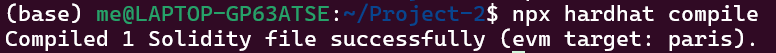
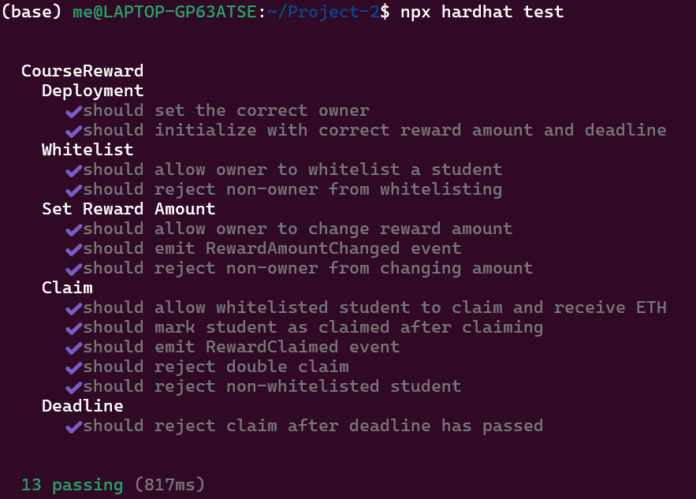
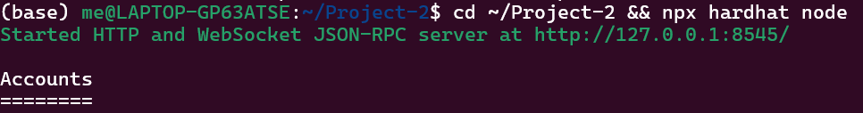
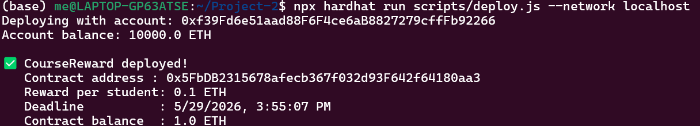
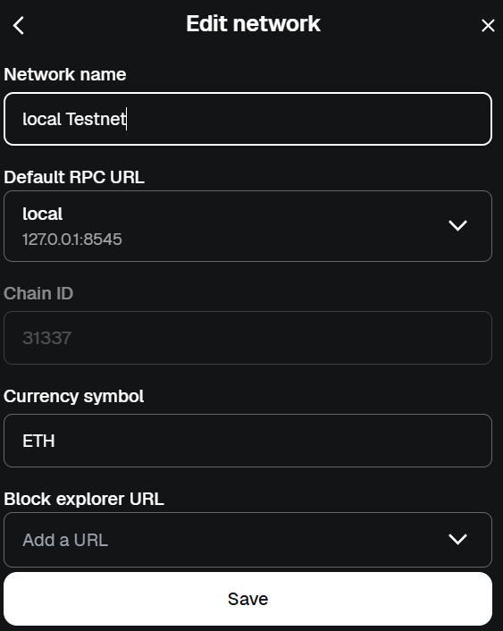
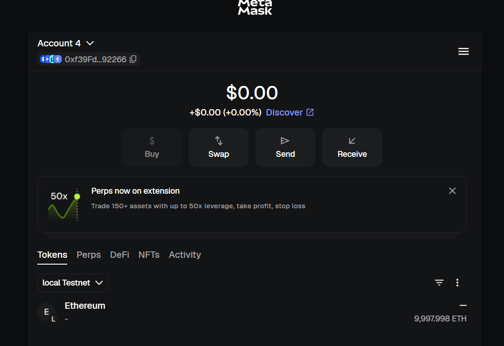
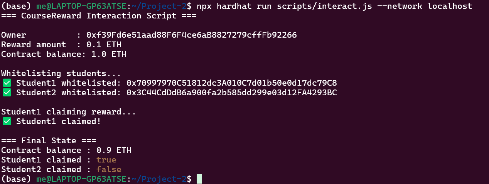
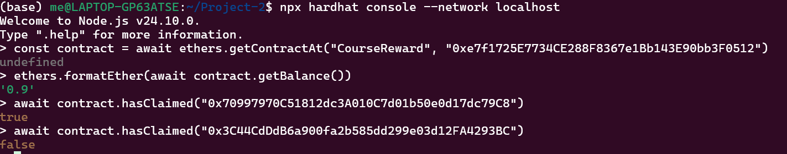

# Course Reward System

## Deskripsi

Smart contract untuk sistem reward mahasiswa yang menyelesaikan kursus. Dosen (owner) dapat mengatur jumlah reward dan whitelist mahasiswa yang berhak claim. Mahasiswa yang sudah di-whitelist dapat melakukan claim reward berupa ETH satu kali sebelum deadline.

## Anggota Kelompok

- Muhammad Faqih Husain (5027231023)

## Fitur

- Owner (dosen) bisa set reward amount
- Owner bisa whitelist mahasiswa yang boleh claim
- Mahasiswa bisa claim reward sekali saja
- Tracking siapa saja yang sudah claim
- Deadline claim — tidak bisa claim setelah batas waktu
- Event logging untuk setiap aksi penting
- Owner bisa withdraw sisa dana kontrak

## Cara Menjalankan

### Prerequisites

- Node.js v18+
- npm

### Installation

```bash
npm install
```

### Compile

```bash
npx hardhat compile
```

### Test

```bash
npx hardhat test
```

### Deploy (Local)

Terminal 1 — jalankan local blockchain:
```bash
npx hardhat node
```

Terminal 2 — deploy contract:
```bash
npx hardhat run scripts/deploy.js --network localhost
```

### Interact (Opsional)

Edit `CONTRACT_ADDRESS` di `scripts/interact.js` dengan alamat hasil deploy, lalu:
```bash
npx hardhat run scripts/interact.js --network localhost
```

## Contract Address

```
0xe7f1725E7734CE288F8367e1Bb143E90bb3F0512
```

## Struktur Contract

| Komponen | Detail |
|---|---|
| State Variables | `owner`, `rewardAmount`, `deadline`, `hasClaimed`, `whitelist` |
| Functions | `setRewardAmount`, `addToWhitelist`, `claim`, `withdraw`, `getBalance` |
| Modifiers | `onlyOwner` |
| Events | `RewardClaimed`, `RewardAmountChanged`, `StudentWhitelisted` |
| Mappings | `hasClaimed`, `whitelist` |

## Screenshot / Bukti

### 1. Compile Berhasil

```
$ npx hardhat compile
Nothing to compile
```

### 2. Test Passing (13 test cases — semua hijau ✅)

```
  CourseReward
    Deployment
      ✔ should set the correct owner
      ✔ should initialize with correct reward amount and deadline
    Whitelist
      ✔ should allow owner to whitelist a student
      ✔ should reject non-owner from whitelisting
    Set Reward Amount
      ✔ should allow owner to change reward amount
      ✔ should emit RewardAmountChanged event
      ✔ should reject non-owner from changing amount
    Claim
      ✔ should allow whitelisted student to claim and receive ETH
      ✔ should mark student as claimed after claiming
      ✔ should emit RewardClaimed event
      ✔ should reject double claim
      ✔ should reject non-whitelisted student
    Deadline
      ✔ should reject claim after deadline has passed

  13 passing (1s)
```

### 3. Deploy Berhasil

```
Deploying with account: 0xf39Fd6e51aad88F6F4ce6aB8827279cffFb92266
Account balance: 9998.9989514265234375 ETH

✅ CourseReward deployed!
   Contract address : 0xe7f1725E7734CE288F8367e1Bb143E90bb3F0512
   Reward per student: 0.1 ETH
   Deadline          : 5/29/2026, 3:42:24 PM
   Contract balance  : 1.0 ETH
```

### 4. Interaksi Berhasil (Whitelist + Claim)

```
=== CourseReward Interaction Script ===

Owner          : 0xf39Fd6e51aad88F6F4ce6aB8827279cffFb92266
Reward amount  : 0.1 ETH
Contract balance: 1.0 ETH

Whitelisting students...
✅ Student1 whitelisted: 0x70997970C51812dc3A010C7d01b50e0d17dc79C8
✅ Student2 whitelisted: 0x3C44CdDdB6a900fa2b585dd299e03d12FA4293BC

Student1 claiming reward...
✅ Student1 claimed!

=== Final State ===
Contract balance : 0.9 ETH
Student1 claimed : true
Student2 claimed : false
```

### 5. MetaMask & Transaksi

#### Compile

#### Test

#### Deploy



#### Metamask




#### Transaksi



#### State

